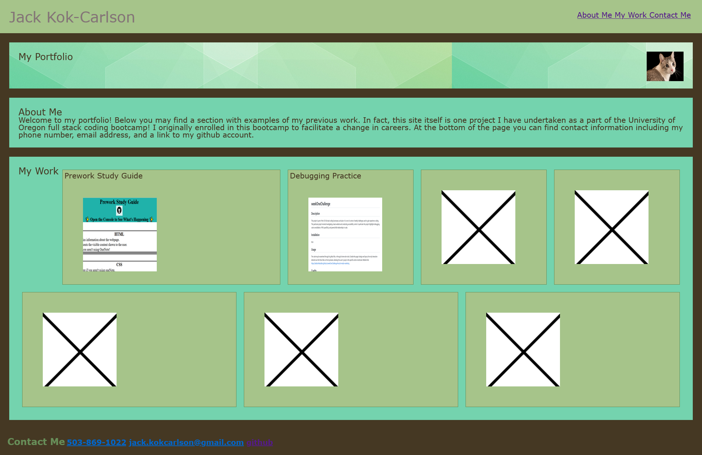

# UO-bootcamp-week-2-challenge-Professional-portfolio-Jack-Kok-Carlson-S-1254bhg1783
## Description
This is a portfolio acting as a framework for future lessons in the UO bootcamp. At its base level, it includes examples of basic formatting in CSS and html. It includes both internal links to separate sections of the page, as well as external links to separate project repositories. The page has some basic responses to device and screen types, altering the flexible layout to improve readability.

## Usage
To use the site, simply click on any of the links, or resize your window on a computer to observe changes in the layout.

## License
Please see the license section of the github repo.